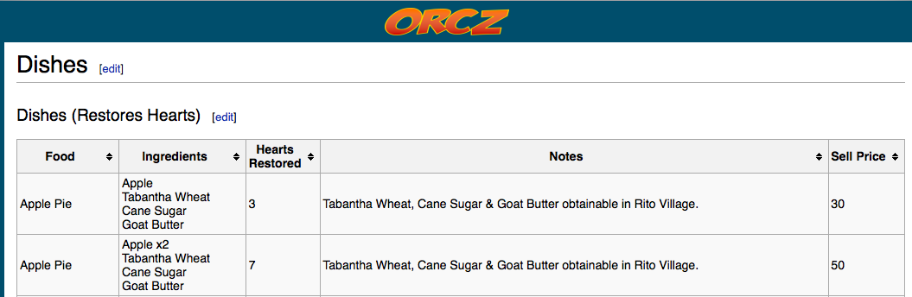
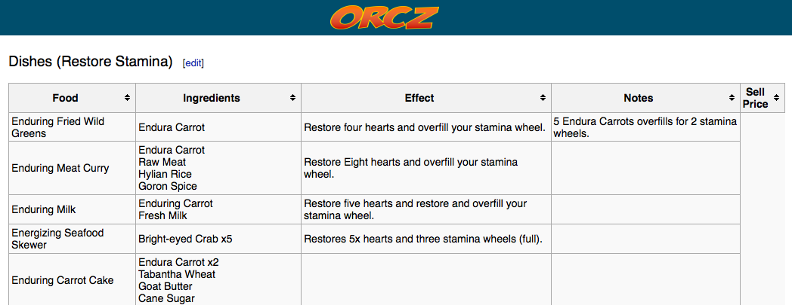
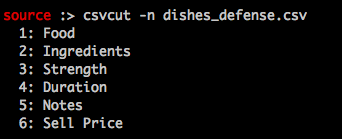

_Formatting Noisy Data_

# Overview

A key factor in the success of any machine learning(ML) project includes formatting your data so that the algorithm you choose has "good" data to work with. What do I mean?

- The data is accurate,
- Features that are quantitative are scaled if needed,
- Features that are qualitative are classified if needed.

For my current project, I'm trying to identify the selling price of recipes you can create in the Nintendo game _Zelda: Breath of the Wild_. Unfortunately there isn't a publicly available database of all ingredients and possible recipes, so I did some googling to see what online resources had data that could be scraped the most easily.

My source information does have several tables of recipes to use! That said, not all tables have the same fields or columns, and some values for these columns contain information that not easy for a program to read without some help:

_Example 1- this table looks like it'd be easy to convert_



_Example 2- this table has information that is contextual and may need some work_



To achieve this, we can use some old school command line tricks, a little script work, as well as hot encoding and scaling techniques so that my training and test data is in a format that's easier for my ML project to read.

## Command line tips

Tools I used- [csvkit](https://csvkit.readthedocs.io/en/1.0.3/#), [tail](http://man7.org/linux/man-pages/man1/tail.1.html)

### csvkit

csvkit is a set of command line tools (written in python!) that help you work with CSVs. Since I use this set of tools at work regularly, I felt comfortable using `csvcut` to extract specific columns from my source data. Once I had all the tables of possible dishes from my internet resource source saved to CSV files, I used the command:

```
$ csvcut -n FILE
```

To quickly examine columns and see how much work would be needed to condense all files into one large resource.

_Example output_



Then, once I had established a list of columns I would need to add or remove from each source table, I could use `csvcut` again to select either a specific column(s) or extract all but a few column(s) as my output:

```
$ csvcut -c 5 dishes_defense.csv > just_notes.csv 
// this gives me just the notes column from the CSV

$ csvcut -C 5 dishes_defense.csv > trimmed_defense.csv
// this gives me all columns except the notes columne
```

Once I had all the columns/fields in my source CSV files in the same order, I could use the tail command to dump all contents of my CSVs starting at a specific row (like row 2, so that I'm not copying headers) into a condensed file:

```
$ tail -n +2 dishes_defense.csv > all_dishes.csv
```

## Scripting for specific use cases

using python csv:
	DictReader and DictWriter
	manually creating ingredient counts based on existing columns from the source
	manually hot encoding recipe and health effects 

## Hot Encoding

Using pandas to hot encode a list of items to separate columns/fields
	- why didn't I use this technique for some items I manually hot encoded in my script file?

## Scaling

using pandas to scale duration, sell price, and health effect details
dropping and concating your work